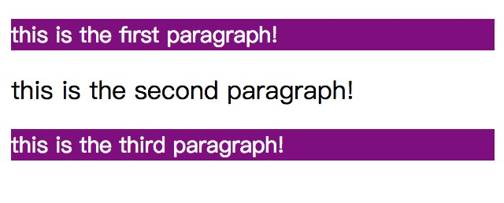

#### only-child  
:only-child 伪类选择的元素是父元素只有一个子元素，并且只有一个子元素；  

例如：  
html:

    

        
this is the first paragraph!

        
this is the second paragraph!

    
 
    

        
this is the third paragraph!

    
 

css:  
        
    p{
        color: #fff;
        font-size: 14px;
        background: grey;
    }
    p:only-child{
        background: purple;
    }

效果：  
  

#### only-of-type  
:only-of-type伪类选择父元素只用一个相同类型的子元素，不排除还有其他元素但是不属于相同类型。  
例如：  
html:  
    
    

        
this is the first paragraph!

        
this is the second paragraph!

    
 
    

        
this is the third paragraph!

    
 

css: 
 
    p{
        color: #fff;
        font-size: 14px;
        background: grey;
    }
    div>p:only-of-type{
        background: purple;
    }

效果：  
  

