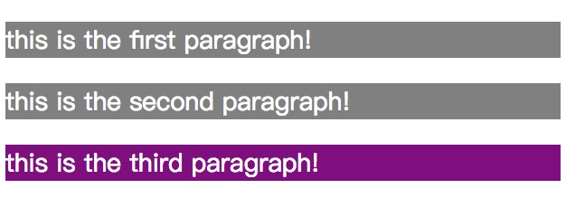

#### only-child  
> :only-child 伪类选择的元素是父元素只有一个同类的元素，并且只有一个元素；  

例如：  
html:

    

        
this is the first paragrap!

        
this is the second paragrap!

    
 
    

        
this is the first paragrap!

    
 

css:  
        
    p{
        color: #fff;
        font-size: 14px;
        background: grey;
    }
    p:only-child{
        background: purple;
    }

效果：  
  
only-of-type

